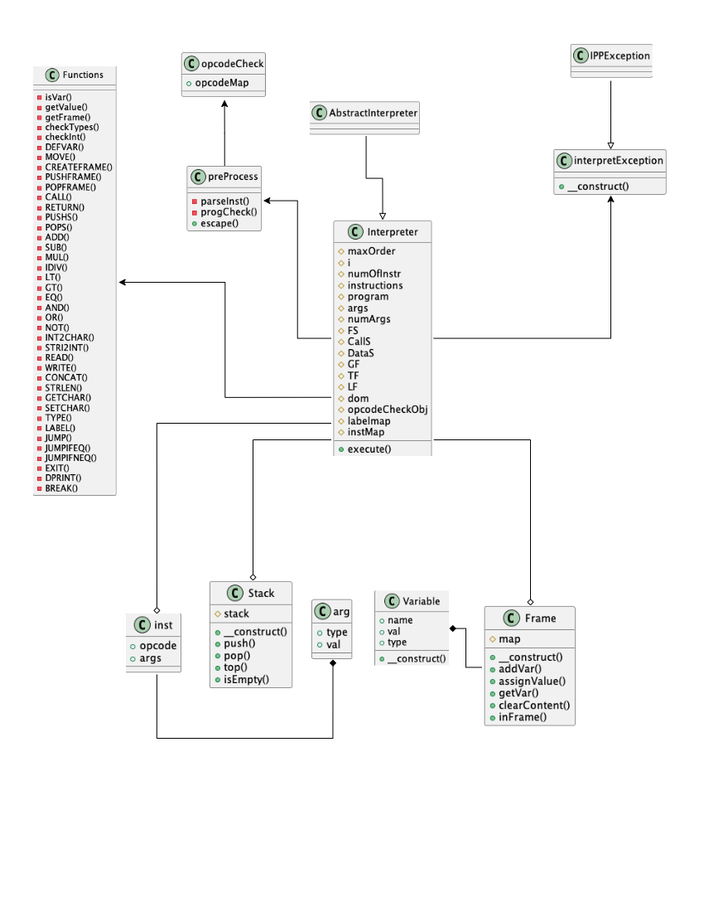

Implementační dokumentace k 2. úloze do IPP 2023/2024
Jméno a příjmení: Jan Lindovský
Login: xlindo04

---

# IPP Student Interpreter Documentation

## Overview

The IPP Interpreter is a PHP-based tool designed to interpret Instruction Processing Program IPPcode24. It processes instructions defined in an XML-like format and executes them accordingly.

## Classes and Traits

### Interpreter Class

The `Interpreter` class, located within the `IPP\Student` namespace, extends the `AbstractInterpreter` class from the `IPP\Core` namespace, inheriting its structure and functionalities. It implements an XML-based interpreter for a specific domain, executing instructions defined in an XML format. 

This interpreter utilizes a combination of traits, including `Functions` and `preProcess`, to handle various aspects of instruction execution, variable management, and XML parsing. 

Key properties of the `Interpreter` class include:
- `maxOrder`: Tracks the maximum order of instructions encountered during parsing.
- `i`: Represents the current instruction index during execution.
- `numOfInstr`: Stores the total number of instructions.
- `instructions`: Contains a list of instruction elements parsed from the XML program.
- `program`: Represents the entire XML program.
- `args`: Stores the arguments of an instruction being processed.
- `numArgs`: Tracks the number of arguments in an instruction.
- `FS`, `CallS`, `DataS`: Stack objects for managing frames, function calls, and data respectively.
- `GF`, `TF`, `LF`: Global, temporary, and local frames for variable storage.
- `dom`: DOMDocument object for handling XML parsing.
- `labelmap`: An associative array mapping label names to their corresponding order in the program.
- `instMap`: Maps instruction names to their respective `inst` class objects.

The `execute()` method serves as the entry point for program execution. It initializes necessary data structures, checks program validity, and iterates through instructions, invoking opcode-specific methods for execution. 

The interpreter processes instructions sequentially, executing opcode-specific functionality for each instruction encountered. 

### interpretException Class

The `interpretException` class extends `IPPException` and handles interpretation-related exceptions.

### Frame Class

The `Frame` class represents a frame within the interpreter. It manages variables and provides methods for manipulation.

#### Methods

- `addVar(string $varName)`: Adds a variable to the frame.
- `assignValue(Variable $symb)`: Assigns a value to a variable.
- `getVar(string $name)`: Retrieves a variable.
- `clearContent()`: Clears the frame.
- `inFrame(string $name)`: Checks if a variable exists.

### Variable Class

The `Variable` class represents a variable in the interpreter. It holds information such as name, value, and type.

### Stack Class

The `Stack` class implements a stack data structure used within the interpreter.

#### Methods

- `push($item)`: Pushes an item onto the stack.
- `pop()`: Pops and returns the top element from the stack.
- `top()`: Returns the top element of the stack.
- `isEmpty()`: Checks if the stack is empty.

### arg Class

The `arg` class represents an argument within an instruction.

### inst Class

The `inst` class represents an instruction in the interpreter.

## Traits

### preProcess Trait

The `preProcess` trait, located within the `IPP\Student` namespace, provides functionalities for processing XML instructions and validating XML programs:
- **escape Method:**  
  The `escape` method utilizes regular expressions to modify strings by replacing specific character sequences.
- **parseInst Method:**  
  Within `parseInst`, XML instructions undergo parsing where opcodes are validated against a predefined map, and argument validity is checked. Arguments are stored in an array indexed by their order within the instruction, with each argument represented by an instance of the `arg` class. This method ensures the correctness of instructions, including the correct opcodes, and adherence to the XML structure.
- **progCheck Method:**  
  The `progCheck` method validates the structure of the XML program. It ensures that the language attribute is set to "IPPcode24" and parses each instruction to ensure correctness.

This trait enhances the robustness of the interpreter by providing essential functionalities for handling XML instructions and validating XML programs.

### Functions Trait

The `Functions` trait, part of the `IPP\Student` namespace, offers vital functionalities for variable management and executing opcode-specific instructions in an XML-based code interpreter. It includes methods like `isVar`, which validates whether an argument represents a variable by confirming the existence and correctness of its frame and variable name. The `getValue` method retrieves the value associated with an argument, handling variables by constructing a `Variable` object based on the extracted frame and variable name. Another method, `getFrame`, extracts the frame and variable name from an argument, ensuring it represents a variable and validating its existence. Additionally, `checkTypes` verifies if the type of a symbol matches its value, ensuring consistency in type declarations, while `checkInt` confirms if two symbols are integers, checking their types and values for compatibility with mathematical operations. The trait also includes instruction functions such as `DEFVAR`, `MOVE`, `CREATEFRAME`, `PUSHFRAME`, and `POPFRAME`, each managing specific opcode functionalities like variable definition, value movement, and frame stack manipulation. Overall, the `Functions` trait is essential for handling variables, conducting type checks, and executing opcode-specific instructions, making it integral to the interpretation of XML-based code.

#### Methods

- `isVar(arg $arg): ?Variable`: Checks if an argument represents a variable and returns the corresponding `Variable` object if found.
- `getValue(string $name, arg $arg): Variable`: Retrieves the value of an argument, handling both variable and immediate values.
- `getFrame(arg $arg): array`: Retrieves the frame and variable name associated with the given argument.
- `checkTypes(Variable $symb): bool`: Checks if the value of a symbol matches its specified type.
- `checkInt(Variable $symb1, Variable $symb2): bool`: Checks if mathematical functions work with integers.
- then it provides methods to interpret instructions

### opcodeCheck Class

The `opcodeCheck` class contains a map of opcodes and their corresponding argument counts for validation.

## UML CLass Diagram

**Class Relationships in an Interpreter System**

This UML class diagram depicts the relationships between various classes involved in an interpreter system. The relationships can be categorized as inheritance, association, and aggregation.

**Inheritance**

* The `Interpreter` class inherit from an abstract `AbstractInterpreter` class. In this context, the `Interpreter` class inherits general functionalities from the `AbstractInterpreter` class. The `interpretException` inherits from `IPPException`.

**Association**

* The `Interpreter` class has associations with various classes (`Functions`, `preProcess`,`interpretException`). These associations represent dependencies or connections between the classes. 

**Aggregation**

* The diagram suggests aggregation relationship between the `Interpreter` class and the stacks, frames and instructions (`Stack`, `Frame`, `inst`). In this context, the stacks and frames might be created and destroyed by the `Interpreter` class, and their lifecycles depend on the interpreter object.

**Additional Notes**

* The class diagram shows the `inst` class containing an `arg` class. This represents a composition relationship, where an `inst` object is composed of one or more `arg` objects (arguments within an instruction). Same is with `Frame` and `Variable`, where Variables are within a Frame.

